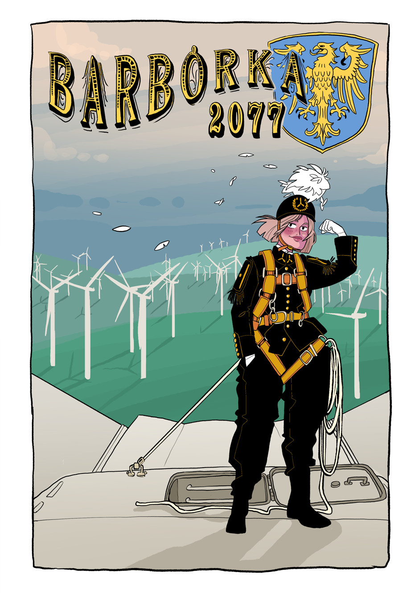
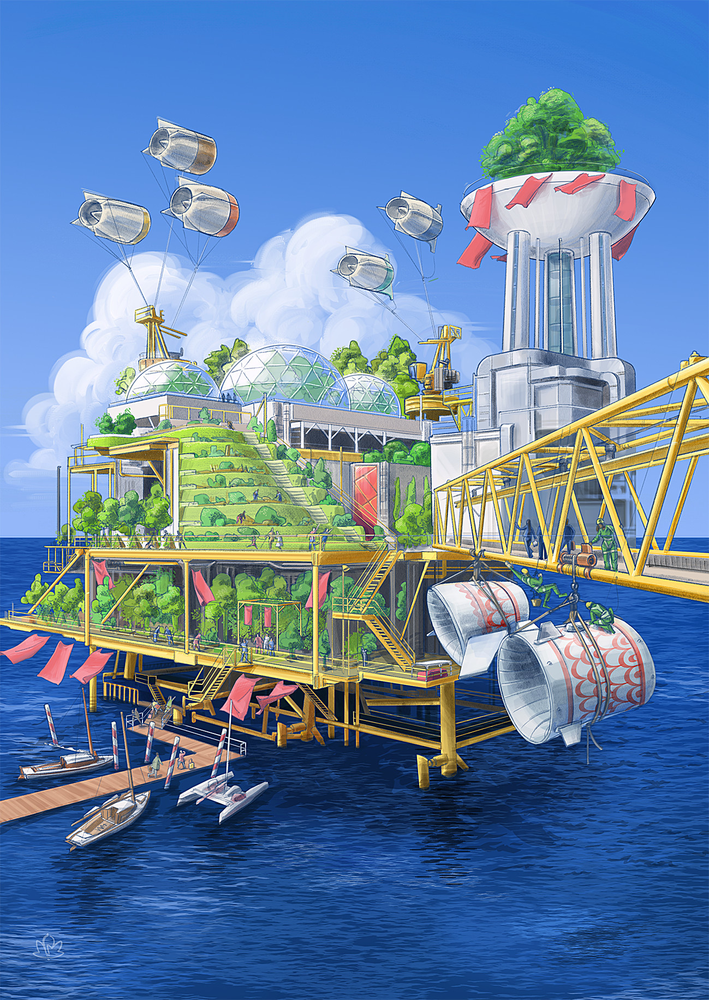

Poniżej znajdziecie ilustracje solarpunkowe objęte licencją [CC-BY-SA 4.0](https://creativecommons.org/licenses/by-sa/4.0/deed.pl), których możecie używać w swoich projektach, również komercyjnych - pamiętając jedynie o podpisaniu autora!

## Barbórka 2077

Ilustracja [Katarzyny "Panny N." Witerscheim](http://panna-n.com/) pierwotnie ukazała się w artykule "Jutronautów" Wyborczej w 2022 roku. Przedstawia ona możliwą przyszłość klimatyczną Śląska, za jedną z polskich zahaczek:

> Gdy na Śląsku zamknięto wszystkie kopalnie, wiele osób myślało, że region zupełnie straci swoją tożsamość. Nikt nie przewidział, że z początkowo tylko kilku kursów obsługi elektrowni wiatrowych Śląsk stworzy nową historię o sobie. Po kilkunastu latach Ślunska Godka stała się de-facto oficjalnym językiem serwisantów wiatraków w kraju, a Barbórka - europejskim Świętem Wiatru.

Mimo, że [Barbórka](https://pl.wikipedia.org/wiki/Barb%C3%B3rka) ma miejsce 4go grudnia, na ilustracji widać zielone wzgórza - symbol zmian, jakie nas czekają.

## Wioska na platformie wiertniczej

Ilustracja autorstwa kolektywu Commando Jugendstil przedstawia kolorową wioskę zbudowaną na opuszczonej platformie wiertniczej, niewykorzystywanej już w świecie bez paliw kopalnianych.
