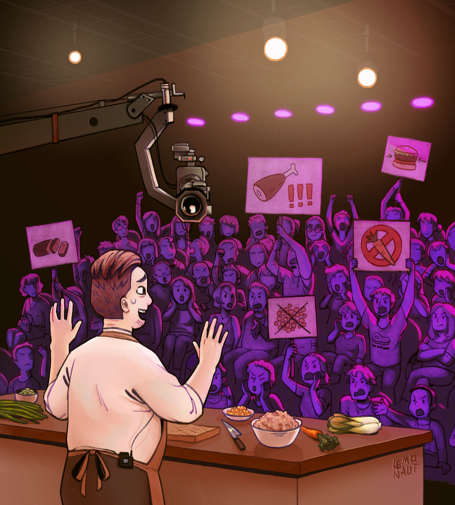
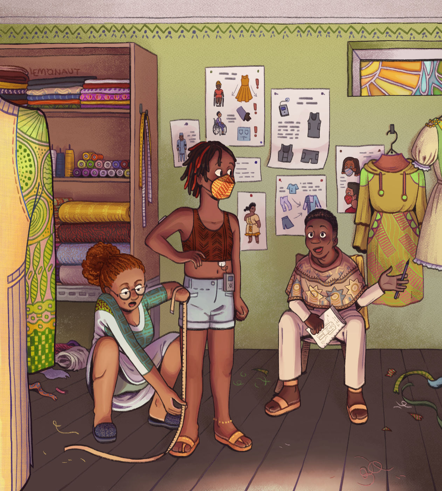
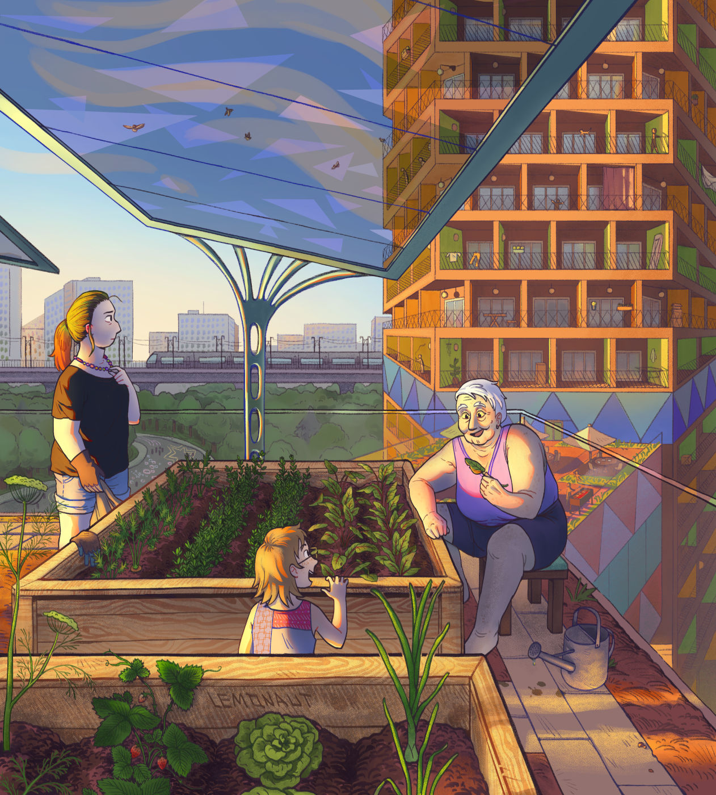

Poniżej znajdziecie ilustracje solarpunkowe objęte licencją [CC-BY-SA 4.0](https://creativecommons.org/licenses/by-sa/4.0/deed.pl), których możecie używać w swoich projektach, również komercyjnych - pamiętając jedynie o podpisaniu autora!

## Barbórka 2077

Ilustracja [Katarzyny "Panny N." Witerscheim](http://panna-n.com/) pierwotnie ukazała się w artykule "Jutronautów" Wyborczej w 2022 roku. Przedstawia ona możliwą przyszłość klimatyczną Śląska, za jedną z polskich zahaczek:

> Gdy na Śląsku zamknięto wszystkie kopalnie, wiele osób myślało, że region zupełnie straci swoją tożsamość. Nikt nie przewidział, że z początkowo tylko kilku kursów obsługi elektrowni wiatrowych Śląsk stworzy nową historię o sobie. Po kilkunastu latach Ślunska Godka stała się de-facto oficjalnym językiem serwisantów wiatraków w kraju, a Barbórka - europejskim Świętem Wiatru.

Mimo, że [Barbórka](https://pl.wikipedia.org/wiki/Barb%C3%B3rka) ma miejsce 4go grudnia, na ilustracji widać zielone wzgórza - symbol zmian, jakie nas czekają.

## Wioska na platformie wiertniczej

Ilustracja autorstwa kolektywu Commando Jugendstil przedstawia kolorową wioskę zbudowaną na opuszczonej platformie wiertniczej, niewykorzystywanej już w świecie bez paliw kopalnianych.

## Kolorowa stołówka

Ilutracja autorstwa [The Lemonaut](https://www.tumblr.com/the-lemonaut) przedstawiająca kolorową i pełną życia scenę z jednej z Zahaczek Solarpunkowych:

> Stołówka w odizolowanej placówce naukowej / środowiskowej, gdzie naukowcy, inżynierowie, kucharze i pracownicy obsługi pokazują sobie nawzajem swoje ludzkie oblicze, jednocześnie pamiętając o tym, jak ważna jest ich rola tutaj i jak trudne warunki panują na zewnątrz (np. czyszczenie oceanów z plastiku, mierzenie poziomu lodu na biegunie północnym itp.).

## Dom kultury

Kolejna ilustracja [The Lemonaut](https://www.tumblr.com/the-lemonaut) przedstawiająca niegdyś mały Dom Kultury, teraz centrum "odnajdywania się na nowo" po utracie profesji i tożsamości:

> Dom kultury początkowo założony, by pomóc górnikom w zdobyciu nowych umiejętności i znalezieniu innej pracy, teraz stał się miejscem nieoficjalnych „pielgrzymek” ludzi dążących do odnalezienia swojej roli w życiu i poznania historii od tych, którzy taką przemianę przeżyli.

## Program kulinarny 

Tym razem [The Lemonaut](https://www.tumblr.com/the-lemonaut) zilustrowała jedną z mniej utopijnych, a bardziej dramatycznych zahaczek. Nie jest to wizja przyszłości do której dążymy, ale wśród pandemii i globalnych problemów infrastrukturalnych może być czymś, co napotkamy.

> Grupa kucharzy, dietetyków i nauczycieli, których zadaniem jest tworzenie i promowanie dobrze dopracowanej i smacznej kuchni wegańskiej/wegetariańskiej w świecie przeżywającym szok kulturowy związany z brakiem niedrogiego mięsa. Czy uda im się powstrzymać masową panikę i zamieszki?

## Krawcy

[The Lemonaut](https://www.tumblr.com/the-lemonaut) wyobraża sobie, jaką rolę będzie pełniło krawiectwo w naszej odżywalnej przyszłości - wizualizując warsztat krawiecki w Afryce Subsaharyjskiej. Na podstawie Zahaczki:

> Nowy Krawiec dołącza do społeczności, która nie miała takiego eksperta przez ostatnich kilka lat. W świecie zdecentralizowanej produkcji nie są już oni tylko rzemieślnikami, ale nauczycielami, ekspertami materiałoznawstwa, projektantami mody i tłumaczami kultur, dbając, by ubiór nie uraził nikogo w trakcie podróży. Czy społeczność zaakceptuje swojego nowego Krawca, znacznie mniej tadycyjnego od swojego poprzednika? Które z jego zachowań poruszyło wszystkich?

## Drewniany blok mieszkalny

Wizja odżywalnego, drewnianego bloku mieszkalnego przyszłości stworzona przez Scan101 i [The Lemonaut](https://www.tumblr.com/the-lemonaut). Został on zbudowany z myślą o społeczności, posiadając mnóstwo przestrzeni wspólnych, a jego dach pokryty jest panelami słonecznymi i ogródkami warzywnymi doglądanymi przez mieszkańców. Ilustracja zainspirowana przez Zahaczkę:

> Społeczność świeżo wprowadziła się do nowego, drewnianego, odżywalnego i udopornionego na zmiany klimatu bloku mieszkalnego. Został on zaprojektowany, by pomóc im stworzyć wspólnotę i zbliżyć się do siebie nawzajem. Dla części mieszkańców jest to szczyt marzeń, podczas gdy inni mierzą się z szokiem kulturowym. Wszyscy z nich stracili swoje poprzednie domy w pożarach, powodziach i programach przesiedleniowych. Kiedy dorośli stawiają czoła trudnym emocjom, ich dzieci z radością eksplorują fascynujące zakamarki budynku. 